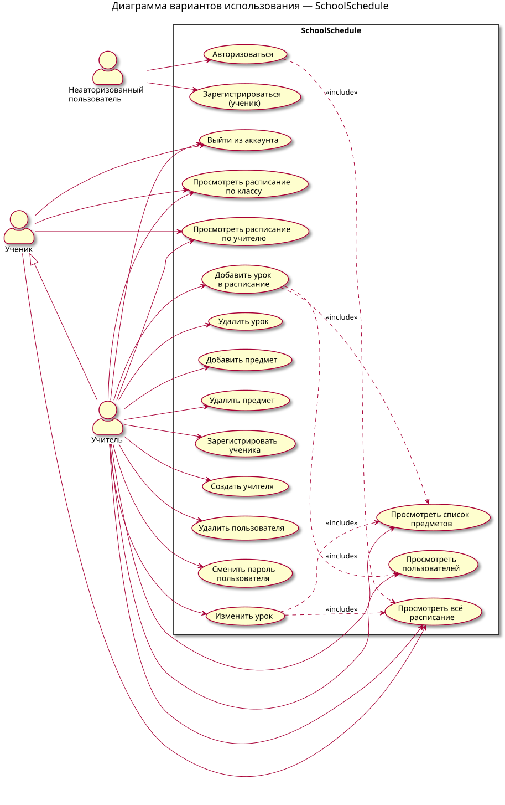

# SchoolSchedule 
SchoolSchedule  — консольное приложение для управления школьным расписанием. Проект предназначен для автоматизации основных процессов работы с школьным расписанием.
Приложение позволяет регистрировать пользователей, выполнять авторизацию и работать с данными расписания, включая дисциплины, учителей и классов.

## Возможности

В проекте реализованы следующие основные возможности:

Возможности:
⦁	регистрация учеников; 
⦁	авторизация пользователей; 
⦁	управление пользователями; 
⦁	регистрация новых предметов;
⦁	удаление предметов;
⦁	просмотр расписания;
⦁	изменение расписания;
⦁	хранение данных в базе данных.




## Структура проекта

```text
LabProject/
│
├── lib/                              # Внешние библиотеки
│   └── sqlite-jdbc-3.53.4.0.jar      # JDBC-драйвер SQLite
│
├── src/                              # Исходный код приложения
│   │
│   ├── Main.java                     # Точка входа в приложение
│   │
│   ├── db/                           # Работа с базой данных
│   │   └── Database.java
│   │
│   ├── model/                        # Модели предметной области
│   │   ├── User.java
│   │   ├── Subject.java
│   │   └── ScheduleEntry.java
│   │
│   ├── dao/                          # Слой доступа к данным
│   │   ├── UserDao.java
│   │   ├── SubjectDao.java
│   │   └── ScheduleDao.java
│   │
│   ├── service/                      # Бизнес-логика приложения
│   │   ├── AuthService.java
│   │   ├── UserService.java
│   │   ├── SubjectService.java
│   │   └── ScheduleService.java
│   │
│   └── ui/                           # Консольный интерфейс
│       └── ConsoleUI.java
│
├── .gitignore                        # Исключения для Git
└── README.md                         # Документация проекта
```

## Архитектура

Приложение построено с использованием многослойной архитектуры.

```text
Пользователь
     │
     ▼
Консольный интерфейс
(ConsoleUI)
     │
     ▼
Сервисный слой
(service)
     │
     ▼
Слой доступа к данным
(dao)
     │
     ▼
База данных
(Database → SQLite)
```

Такое разделение позволяет отделить пользовательский интерфейс от бизнес-логики и операций с данными.

### Основные компоненты

#### `Main.java`

Точка входа в приложение. Инициализирует базу данных и запускает консольный интерфейс.

#### `ui/ConsoleUI.java`

Содержит логику взаимодействия с пользователем через консольное меню. Разделяет меню ученика и меню учителя, обеспечивая разграничение прав доступа.

#### `db/Database.java`

Отвечает за подключение к SQLite и инициализацию схемы базы данных (создание таблиц users, subjects, schedule, создание учётной записи администратора по умолчанию).

#### `model`

Содержит модели основных сущностей предметной области:
⦁	User — пользователь системы (ученик или учитель);
⦁	Subject — учебный предмет; 
⦁	ScheduleEntry — одна запись расписания (день, номер урока, предмет, учитель, класс).  
	
#### `dao`

Содержит компоненты, отвечающие за получение, добавление, изменение и удаление данных:
⦁	UserDao — работа с таблицей пользователей;
⦁	SubjectDao — работа с таблицей предметов;
⦁	ScheduleDao — работа с расписанием (включая JOIN с предметами и учителями). 
	
#### `service`

Содержит бизнес-логику приложения и обеспечивает взаимодействие между пользовательским интерфейсом и слоем доступа к данным:
⦁	AuthService — вход и выход, хранение текущего пользователя;
⦁	UserService — регистрация и управление пользователями;
⦁	SubjectService — управление предметами;
⦁	ScheduleService — просмотр и редактирование расписания с валидацией данных.
	
## Требования

Для запуска проекта необходимо установить:

    JDK 17 или выше;

    Git (опционально).

Внешние зависимости — только JDBC-драйвер SQLite (sqlite-jdbc-3.53.4.0.jar), который уже лежит в папке lib/.

## Установка

### 1. Клонирование репозитория

```bash
git clone <repository-url>
cd SchoolSchedule
```

### 2. Проверка JDK

```bash
java -version
javac -version
```

## Запуск приложения

Из корневой папки проекта выполните:

```bash
java -Dfile.encoding=UTF-8 -cp "out\production\LabProject;lib\sqlite-jdbc-3.53.4.0.jar" Main
```

После запуска в консоли будет отображено главное меню приложения.

```text
=== Система учёта школьного расписания ===

--- Главное меню ---
1. Войти
2. Зарегистрироваться (ученик)
0. Выход
```

Пользователь может выбрать необходимое действие, введя соответствующий номер.

### Учётные записи по умолчанию

При первом запуске автоматически создаётся учитель:

```text
Логин: admin
Пароль: admin
```

Через учётную запись учителя можно добавлять предметы, создавать других учителей и заполнять расписание. Учеников можно регистрировать прямо из главного меню без авторизации.

## Работа в IntelliJ IDEA

*Открыть проект (File → Open → выбрать LabProject).
*File → Project Structure → Modules → Dependencies → + → JARs → выбрать lib/sqlite-jdbc-3.53.4.0.jar.
*При необходимости включить эмуляцию терминала: Run → Edit Configurations → Modify options → Emulate terminal in output console.
*Запустить класс Main.

## Используемые технологии

*Java 17;
*JDBC;
*SQLite;
*IntelliJ IDEA;

## Разработка

Исходный код проекта располагается в каталоге:

```text
src/
```

При разработке рекомендуется соблюдать следующую организацию кода:

*модели предметной области размещать в model;
*работу с базой данных размещать в dao;
*бизнес-логику размещать в service;
*код пользовательского интерфейса размещать в ui и отделять его от бизнес-логики.

## Лицензия

Проект является учебным проектом. Условия использования могут быть определены в файле LICENSE.